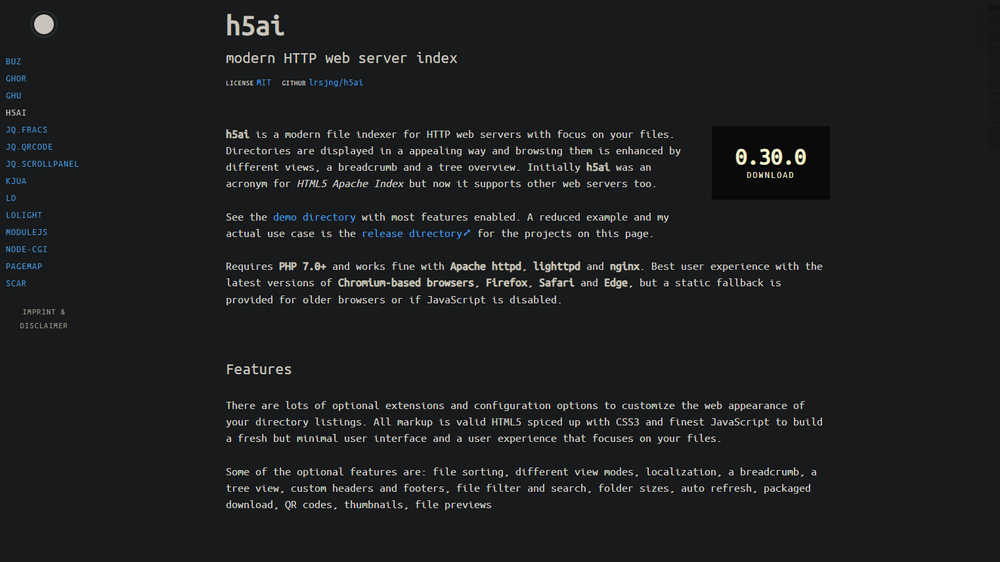

### this example uses the h5ai modern HTTP web server index


## 

[download from here](https://release.larsjung.de/h5ai/h5ai-0.30.0.zip)

##### https://larsjung.de/h5ai/

In this example, I have appended (include /etc/nginx/sites-enabled/*;) to the end of the {http} block in (_config/nginx.conf)

##### commands for lazy people

```sh
cd example;
curl https://release.larsjung.de/h5ai/h5ai-0.30.0.zip -o h5ai-0.30.0.zip;
gunzip h5ai-0.30.0.zip;
docker compose up;
```

##

##### this will create a container called web-cdn at (docker-host-ip:10001)